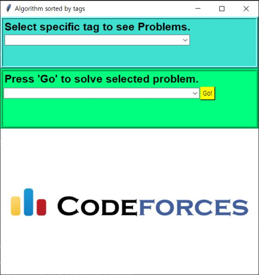
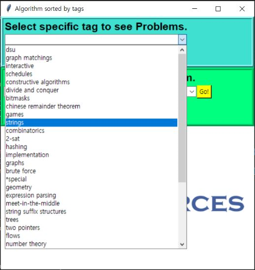
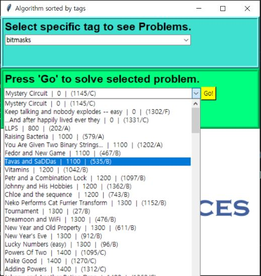

# Code Forces Algorithm Classifier  
***  
___purpose___ : Menu bar of Code Forces page does not have 'Algorithm' element (lists of problems with specific algorithm keyword)  
___목적___ : 코드포스 홈페이지 메뉴 항목에 특정 알고리즘 키워드 문제들만 확인할 수 있는 카테고리가 없다.(알고리즘별 문제 확인이 여러움)
 
___Consists of..___  
* make_db.py  
    - Using Code Forces Open API generate problemset databse(MySQL)  
    - Table Schema (prob_set):  

|  Column  |  type  |  
|  :--:  |  :--:  |  
|id|varchar(50)|  
|name|varchar(65)|  
|difficulty|int|  
|tags|set|  

* CAC.py  
    - Creating TK interface from generated database  
    - Run screen  
        - Main  

        - Selection1 (select specific algorithm keyword)  

        - Selection2 (select specific problem to solve)  
  
        - 'Go' button will open browser of selected problem  
    
